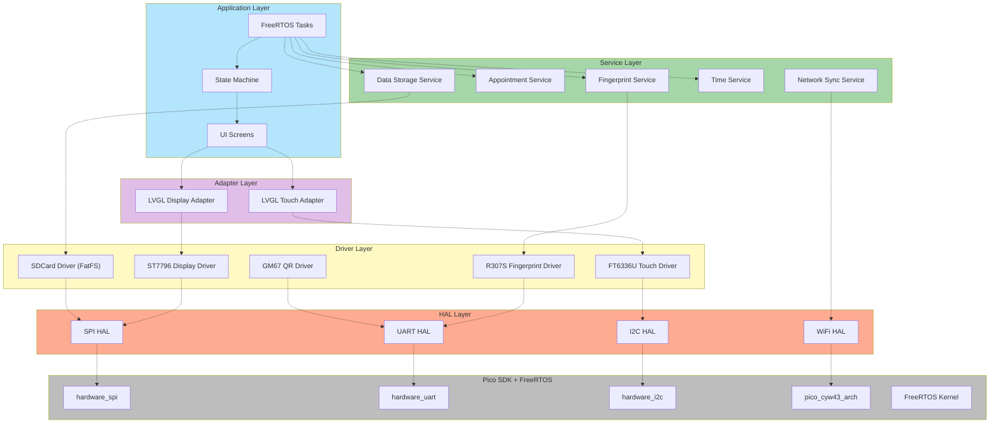

# medical-clinic-checkin
Repositório com o desenvolvimento de código embarcado para funcionalidades de check-in em clínicas médicas, baseado em Raspberry Pi Pico W. O sistema integra tecnologias de Sistemas Embarcados de Tempo Real (RTOS), Visão Computacional, Biometria e Integração Cloud em uma arquitetura robusta e escalável.

# Arquitetura de Branches (Estratégia de Hardware)

Para atender a diferentes requisitos de custo e segurança, o projeto está segmentado em três implementações principais:

| Branch | Foco Tecnológico	| Diferencial de Engenharia |
|------|---------|---------|
| rp2040 |	Eficiência & Custo | Otimização para Dual-Core ARM Cortex-M0+ e gestão rigorosa de 264KB de RAM |
| rp2350 |	Performance & Segurança	| Utilização de ARM Cortex-M33, aceleração de ponto flutuante (FPU) e isolamento TrustZone |
| api |	Integração & Cloud | Gateway de comunicação REST e gestão de templates biométricos via PostgreSQL |

Para alternar entre estas implementações, basta executar o seguinte comando no seu terminal:

```
git checkout <nome-da-branch>
```

##
| Branch | Foco Tecnológico	| Diferencial de Engenharia |
|------|---------|---------|
| Camada | Tecnologia | Justificativa Técnica |
| KernelFreeRTOS | Garante determinismo nas tarefas de UI e validação de biometria.
| Interface (GUI) | LVGL v8.3.11 | Motor gráfico otimizado para hardware limitado com suporte a antialiasing.
| Persistência | FatFS (SD Card) | | Sistema de arquivos resiliente para armazenamento de logs e agendamentos offline. | 
| Parsing | cJSON | Manipulação eficiente de objetos JSON provenientes da leitura de QR Codes. | 
| Build System | CMake + Ninja | Automação de build multiplataforma e gestão de dependências via FetchContent. |


---

## Visão Geral

| Item | Detalhe |
|------|---------|
| **MCU** | RP2040W — Dual-core ARM Cortex-M0+ @ 133 MHz, WiFi CYW43439 |
| **RTOS** | FreeRTOS (5 tasks, queues, event groups) |
| **UI** | LVGL v8.3.11 — 7 telas, ícones desenhados via código |
| **Linguagem** | C++17 / C11 |
| **Build** | CMake ≥ 3.13 + Ninja 1.12.1 + GCC ARM 14_2_Rel1 |

**Funcionalidades principais:**
- Leitura de QR Code via scanner GM67 (UART)
- Validação de agendamento com dados armazenados no SD Card (FatFS)
- Verificação e cadastro de impressão digital via sensor R307S
- Sincronização de agendamentos e templates biométricos com API REST (Mongoose HTTP)
- Sincronização de hora via NTP (SNTP/lwIP)
- Interface touchscreen 4.0" 480×320

---

## Hardware

| Periférico | Interface | Pinos |
|-----------|-----------|-------|
| Display ST7796 4.0" TFT 480×320 | SPI0 | MOSI=GP19, SCK=GP18, CS=GP17, DC=GP20, RST=GP21 |
| Touch FT6336U (Capacitivo) | I2C1 | SDA=GP6, SCL=GP7, RST=GP8, INT=GP9 |
| Scanner QR GM67 | UART0 | TX=GP0, RX=GP1 |
| Sensor Biométrico R307S | UART1 | TX=GP4, RX=GP5 |
| SD Card (FAT32) | SPI1 | MISO=GP12, MOSI=GP15, SCK=GP14, CS=GP13 |
| WiFi CYW43439 | Integrado | — |

> Diagrama completo em [`docs/diagrams/hardware_diagram.md`](medical-clinic-checkin-pico/docs/diagrams/hardware_diagram.md)

---

## Arquitetura de Software

O software foi projetado seguindo o padrão de Camadas de Abstração de Hardware (HAL), permitindo portabilidade total entre RP2040 e RP2350:



### Tasks FreeRTOS

| Task | Prioridade | Stack | Responsabilidade |
|------|:----------:|:-----:|------------------|
| `WiFi_Time_Init` | 5 | 2048 | Conecta WiFi, sincroniza NTP, auto-deleta após sucesso |
| `LVGL` | 4 | 3072 | `lv_timer_handler()` a cada 20 ms, gerencia telas por estado |
| `QR_Reader` | 3 | 1536 | Leitura contínua do GM67, envia dados para fila |
| `QR_Validator` | 2 | 2048 | Valida QR, biometria, marca check-in (orquestrador) |
| `Network` | 2 | 3072 | Download de agendamentos/templates, atualiza status na API |

### Services (Singletons)

| Service | Função |
|---------|--------|
| `AppointmentService` | Valida QR JSON, busca agendamento no SD, verifica CPF e janela de horário (−20/+10 min) |
| `NetworkSyncService` | Cliente HTTP (Mongoose): autenticação JWT, download/upload de agendamentos e templates |
| `DataStorageService` | Lê/grava JSON de agendamentos e templates `.dat` de fingerprint no SD Card (FatFS) |
| `TimeService` | Sincroniza NTP → RTC do RP2040, fornece data/hora formatadas |
| `FingerprintService` | Cadastro (2 capturas → template → SD + API) e verificação de digitais via R307S |

---

## Estrutura do Projeto

```
├── CMakeLists.txt
├── pico_sdk_import.cmake
│
├── config/
│   ├── api_config.hpp                  # URL da API, endpoints, credenciais, timeouts
│   ├── display_config.hpp              # Resolução, rotação, SPI speed, buffer LVGL
│   ├── fingerprint_config.hpp          # UART e baudrate do sensor biométrico
│   ├── FreeRTOSConfig.h                # Configuração do kernel FreeRTOS
│   ├── hw_config.c                     # Configuração do SD Card (FatFS)
│   ├── lv_conf.h                       # Configuração do LVGL
│   ├── lvgl_tick_custom.h              # Tick customizado do LVGL para FreeRTOS
│   ├── lwipopts.h                      # Configuração do lwIP (TCP/IP stack)
│   ├── mongoose_config.h               # Configuração do Mongoose HTTP
│   ├── pin_config.hpp                  # Mapeamento de todos os GPIOs
│   ├── qr_code_reader_config.hpp       # UART e baudrate do scanner QR
│   ├── sntp_callbacks.h                # Callbacks de sincronização NTP
│   └── wifi_config.hpp                 # SSID, senha e país do WiFi
│
├── src/
│   ├── main.cpp                        # Entry point: init drivers → create tasks → scheduler
│   │
│   ├── core/
│   │   ├── state_machine.hpp           # Máquina de estados (singleton, 11 estados)
│   │   └── state_machine.cpp
│   │
│   ├── hal/
│   │   ├── interfaces/
│   │   │   ├── hal_spi_interface.hpp   # Interface abstrata SPI
│   │   │   ├── hal_i2c_interface.hpp   # Interface abstrata I2C
│   │   │   ├── hal_uart_interface.hpp  # Interface abstrata UART
│   │   │   └── hal_wifi_interface.hpp  # Interface abstrata WiFi
│   │   └── rp2040/
│   │       ├── hal_spi_rp2040.hpp/.cpp
│   │       ├── hal_i2c_rp2040.hpp/.cpp
│   │       ├── hal_uart_rp2040.hpp/.cpp
│   │       └── hal_wifi_rp2040.hpp/.cpp
│   │
│   ├── drivers/
│   │   ├── display/
│   │   │   ├── interface/display_interface.hpp
│   │   │   └── st7796/st7796_driver.hpp/.cpp
│   │   ├── touch/
│   │   │   ├── interface/touch_interface.hpp
│   │   │   └── ft6336u/ft6336u_driver.hpp/.cpp
│   │   ├── qr_code_reader/
│   │   │   ├── interface/qr_interface.hpp
│   │   │   └── gm67/gm67_driver.hpp/.cpp
│   │   └── fingerprint/
│   │       ├── interface/fingerprint_interface.hpp
│   │       └── r307s/r307s_driver.hpp/.cpp
│   │
│   ├── adapters/lvgl/
│   │   ├── lvgl_display_adapter.hpp/.cpp
│   │   └── lvgl_touch_adapter.hpp/.cpp
│   │
│   ├── services/
│   │   ├── appointment_service.hpp/.cpp     # Validação de QR e agendamentos
│   │   ├── data_storage_service.hpp/.cpp    # Leitura/escrita no SD Card
│   │   ├── fingerprint_service.hpp/.cpp     # Cadastro e verificação biométrica
│   │   ├── network_sync_service.hpp/.cpp    # Cliente HTTP (Mongoose)
│   │   └── time_service.hpp/.cpp            # NTP → RTC, data/hora
│   │
│   ├── tasks/
│   │   ├── task_wifi_time_init.hpp/.cpp     # Conexão WiFi + sincronização NTP
│   │   ├── task_lvgl.hpp/.cpp               # Loop LVGL + gerência de telas
│   │   ├── task_qr_reader.hpp/.cpp          # Leitura contínua do scanner QR
│   │   ├── task_qr_validator.hpp/.cpp       # Validação e orquestração do check-in
│   │   └── task_network.hpp/.cpp            # Download de agendamentos e templates
│   │
│   ├── ui/screens/
│   │   ├── welcome_screen.hpp/.cpp          # Tela principal (idle)
│   │   ├── init_status_screen.hpp/.cpp      # Tela de boot (WiFi, NTP, SD)
│   │   ├── appointment_screen.hpp/.cpp      # Check-in confirmado
│   │   ├── error_screen.hpp/.cpp            # Erro recuperável
│   │   ├── error_critical_screen.hpp/.cpp   # Erro crítico + countdown reboot
│   │   ├── fingerprint_operation_screen.hpp/.cpp  # Verificação/cadastro digital
│   │   └── fingerprint_upload_screen.hpp/.cpp     # Upload de template
│   │
│   └── tests/code_examples/
│       ├── README.md                        # Instruções dos demos
│       ├── lvgl_rtos_demo.cpp               # Demo display + touch
│       ├── qr_code_reader_demo.cpp          # Demo scanner QR
│       ├── fingerprint_demo.cpp             # Demo sensor biométrico
│       ├── sdcard_fatfs_demo.cpp            # Demo SD Card
│       └── wifi_demo.cpp                    # Demo WiFi
│
├── lib/
│   ├── FreeRTOS-Kernel/                     # Submodule
│   └── no-OS-FatFS/                         # Submodule
│
└── docs/
    ├── dev/                                 # Notas de desenvolvimento por periférico
    └── diagrams/
        ├── hardware_diagram.md
        ├── software_architecture_layers_diagram.md
        ├── class_diagrams.md
        ├── sequence_diagrams.md
        └── state_machine_diagram.md
```
Licença & Uso
Este projeto está licenciado sob a MIT License. Sinta-se à vontade para explorar, modificar e contribuir, mantendo os créditos originais.
---

👥 Autoras
Adriana Rocha Castro de Paula
Luana Menezes

---
Projeto desenvolvido como parte da Residência Tecnológica em Sistemas Embarcadosdo, do programa EmbarcaTech - Polo Campinas/SP.
---
