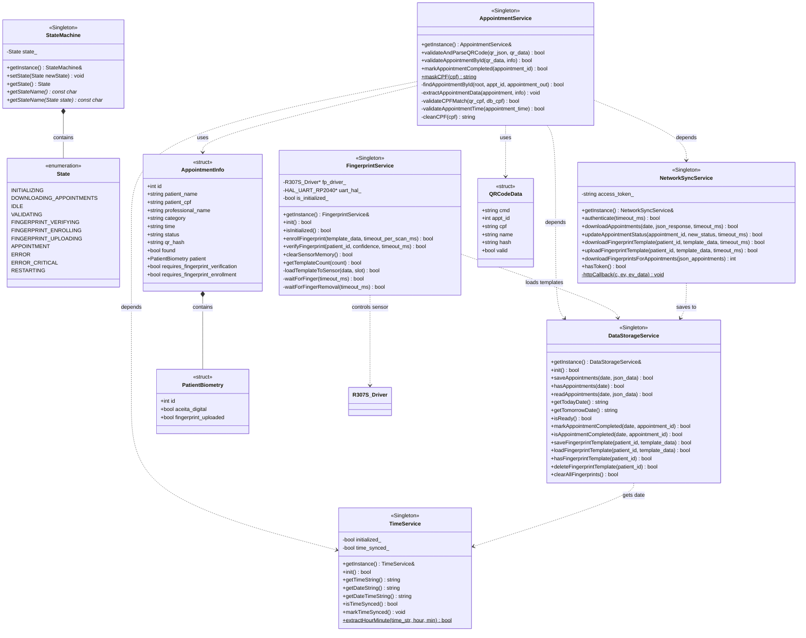
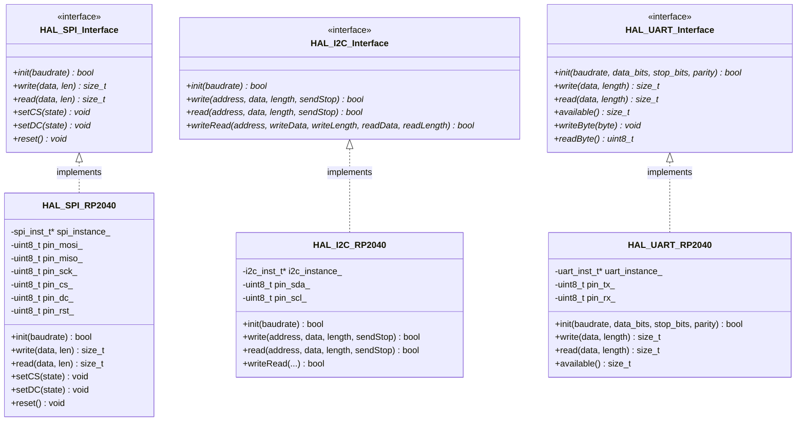
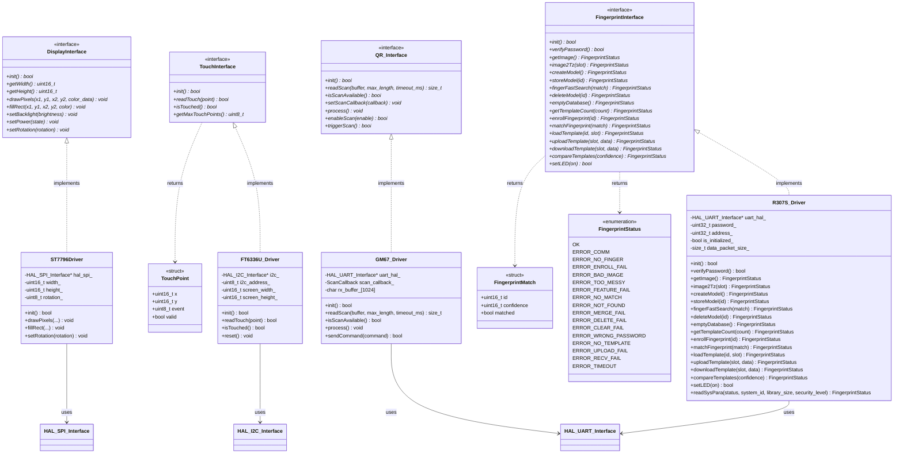
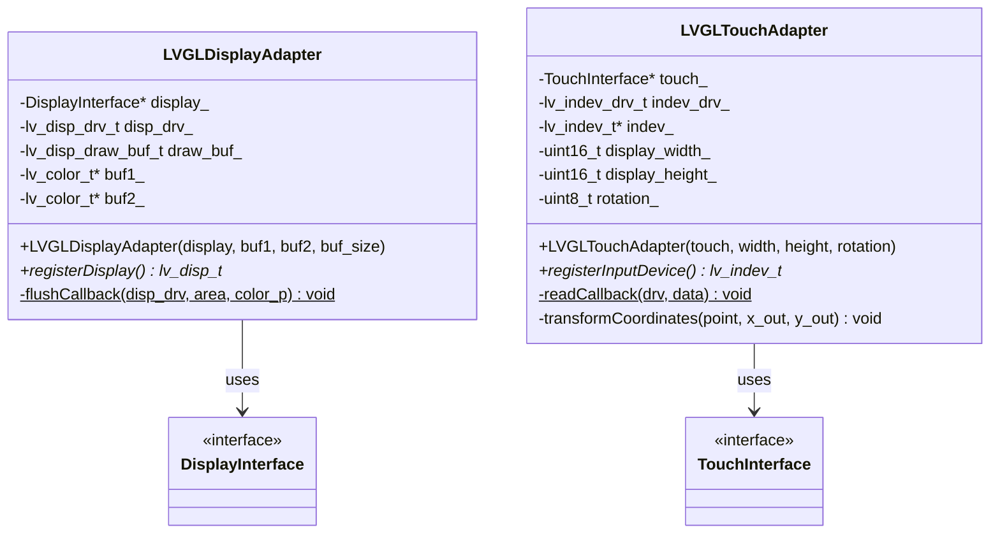

# Class Diagrams

Diagramas de classes de todas as camadas do sistema.

---

## 1. Services Layer

Camada de serviços com lógica de negócio.

---

## 2. HAL Layer (Hardware Abstraction)

Interfaces abstratas e implementações específicas do RP2040.

---

## 3. Driver Layer

Drivers de hardware com interfaces abstratas.

---

## 4. Adapter Layer

Adaptadores entre LVGL e drivers de hardware.

---
