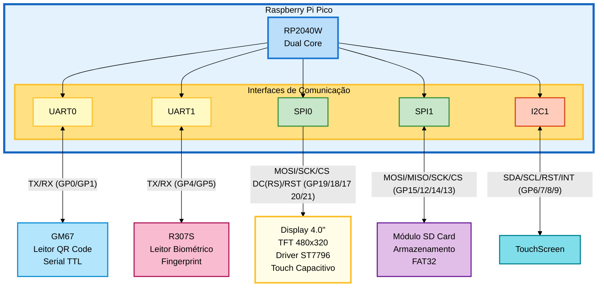

# Hardware Architecture

```mermaid
graph TB
    subgraph RPI["Raspberry Pi Pico<br/>"]
        CPU["RP2040W<br/>Dual Core<br/>"]
        
        subgraph Interfaces["Interfaces de Comunicação"]
            UART0["UART0"]
            UART1["UART1"]
            SPI0["SPI0"]
            SPI1["SPI1"]
            I2C1["I2C1"]
        end
        
        CPU --> UART0
        CPU --> UART1
        CPU --> SPI0
        CPU --> SPI1
        CPU --> I2C1
    end
    
    UART0 <-->|"TX/RX (GP0/GP1)"| QR["GM67<br/>Leitor QR Code<br/>Serial TTL"]
    UART1 <-->|"TX/RX (GP4/GP5)"| FP["R307S<br/>Leitor Biométrico<br/>Fingerprint"]
    SPI0 -->|"MOSI/SCK/CS DC(RS)/RST (GP19/18/17 20/21)"| DISPLAY["Display 4.0&quot;<br/>TFT 480x320<br/>Driver ST7796<br/>Touch Capacitivo"]
    SPI1 <-->|"MOSI/MISO/SCK/CS (GP15/12/14/13)"| SD["Módulo SD Card<br/>Armazenamento<br/>FAT32"]
    I2C1 <--> |"SDA/SCL/RST/INT (GP6/7/8/9)"| TOUCH["TouchScreen"]
    

    style RPI fill:#e3f2fd,stroke:#1565c0,stroke-width:4px,color:#000
    style CPU fill:#bbdefb,stroke:#1976d2,stroke-width:3px,color:#000
    style Interfaces fill:#ffe082,stroke:#fbc02d,stroke-width:3px,color:#000
    style UART0 fill:#fff9c4,stroke:#fbc02d,stroke-width:2px,color:#000
    style UART1 fill:#fff9c4,stroke:#fbc02d,stroke-width:2px,color:#000
    style SPI0 fill:#c8e6c9,stroke:#388e3c,stroke-width:2px,color:#000
    style SPI1 fill:#c8e6c9,stroke:#388e3c,stroke-width:2px,color:#000
    style I2C1 fill:#ffccbc,stroke:#d84315,stroke-width:2px,color:#000
    style QR fill:#b3e5fc,stroke:#0288d1,stroke-width:2px,color:#000
    style FP fill:#f8bbd0,stroke:#ad1457,stroke-width:2px,color:#000
    style DISPLAY fill:#fffde7,stroke:#fbc02d,stroke-width:3px,color:#000
    style SD fill:#e1bee7,stroke:#6a1b9a,stroke-width:2px,color:#000
    style TOUCH fill:#80deea,stroke:#00838f,stroke-width:2px,color:#000

    linkStyle default stroke:#000,stroke-width:1px,color:#000
```