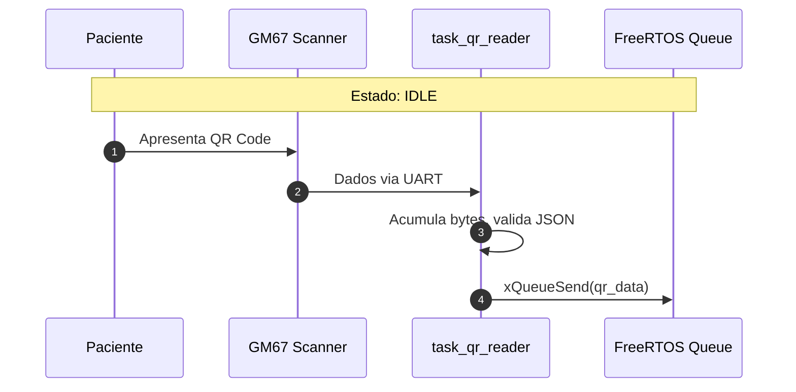
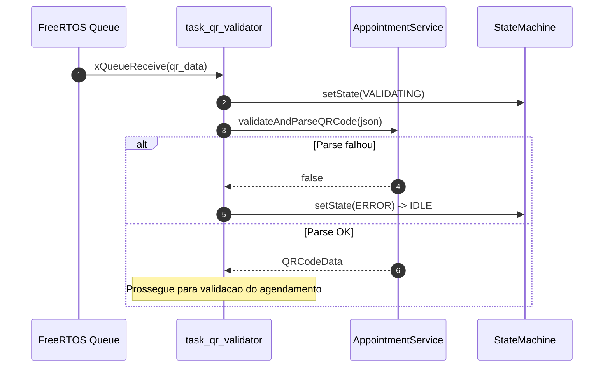
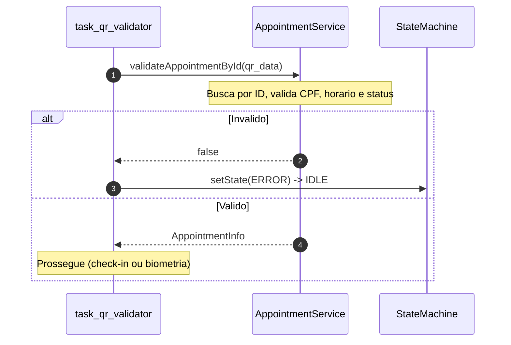
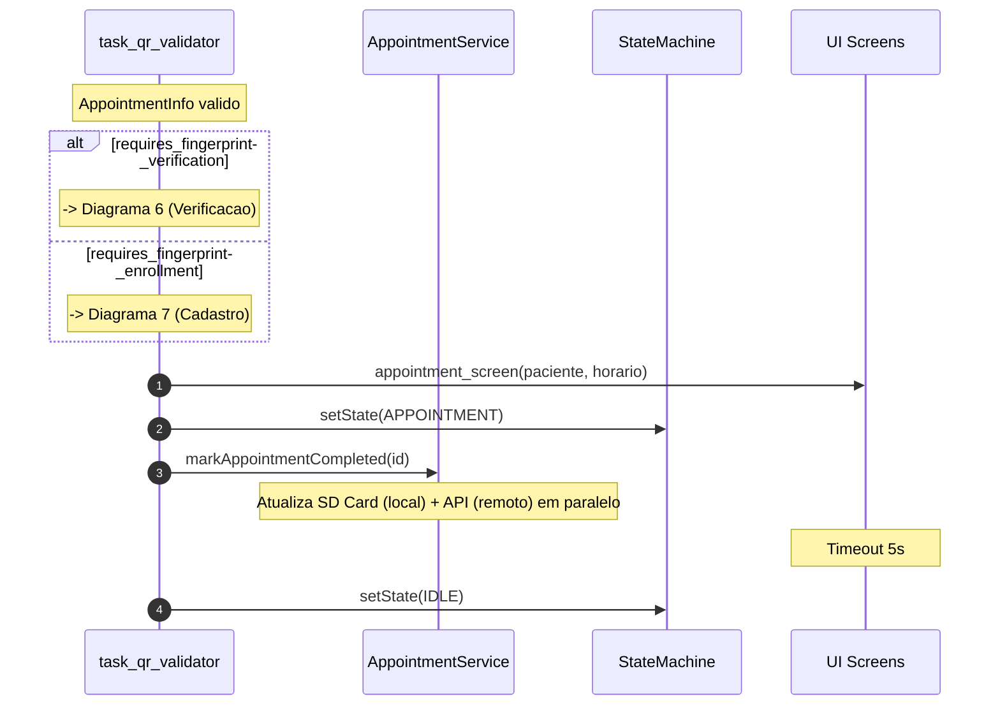
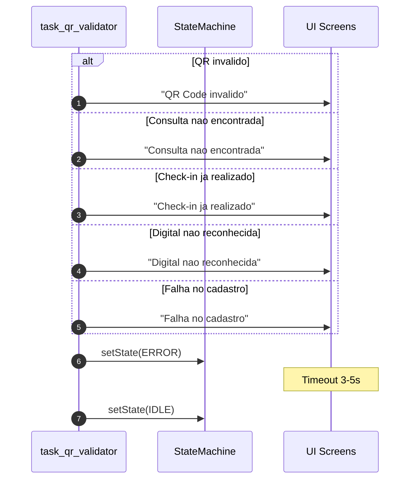
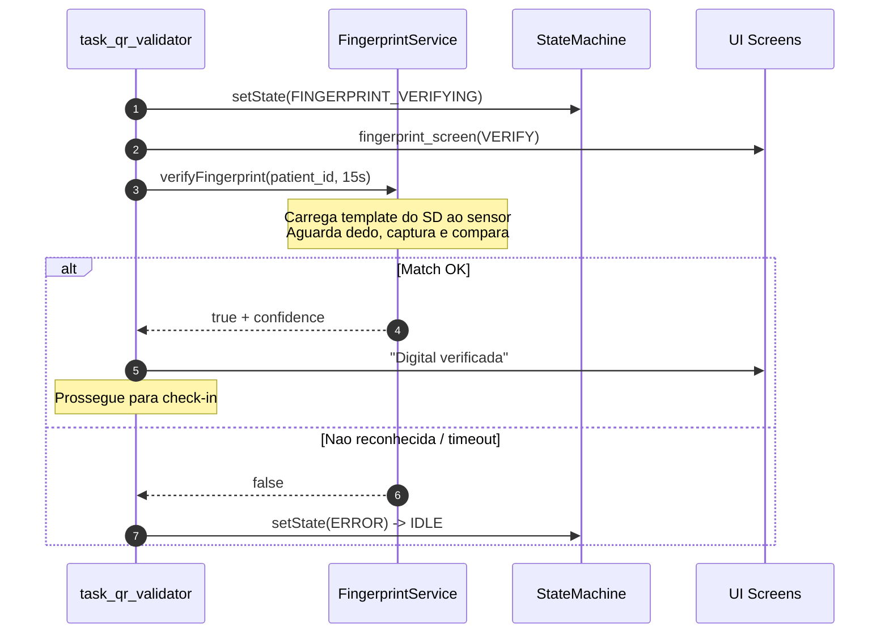
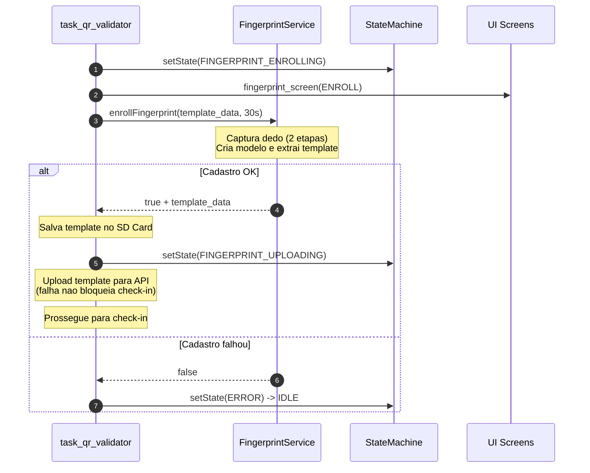
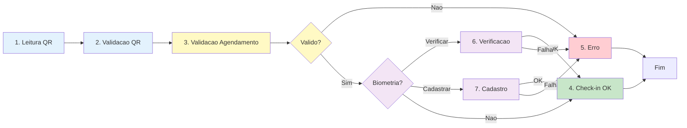

# Sequence Diagrams

Diagramas de sequência do sistema de check-in médico.

---

## 1. Leitura do QR Code

Do scan até a fila FreeRTOS.

---

## 2. Validacao do QR Code

Parse do JSON recebido.

---

## 3. Validacao do Agendamento

Busca e validacao da consulta no SD Card.

---

## 4. Check-in com Sucesso

Fluxo apos validacao, incluindo decisao de biometria.

---

## 5. Tratamento de Erros

Cenarios de erro e retorno ao IDLE.

---

## 6. Verificacao Biometrica

Paciente ja tem template cadastrado -- verificacao 1:1.

---

## 7. Cadastro Biometrico

Paciente sem template -- cadastro e upload para API.

---

## Fluxo Geral (Resumo)

