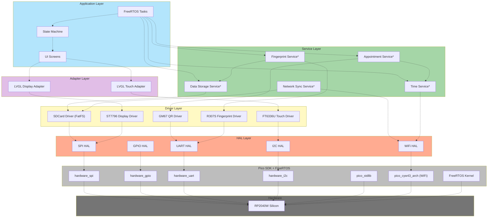

# Software Architecture

```mermaid
graph TB
    subgraph Application["Application Layer"]
        Tasks["FreeRTOS Tasks"]
        StateMachine["State Machine"]
        UI["UI Screens"]
    end

    subgraph Service["Service Layer"]
        DataStorage["Data Storage Service*"]
        AppointmentSvc["Appointment Service*"]
        NetworkSync["Network Sync Service*"]
        TimeSvc["Time Service*"]
        FingerprintSvc["Fingerprint Service*"]
    end

    subgraph Adapter["Adapter Layer"]
        LVGLDisplay["LVGL Display Adapter"]
        LVGLTouch["LVGL Touch Adapter"]
    end

    subgraph Driver["Driver Layer"]
        SDCard["SDCard Driver (FatFS)"]
        ST7796["ST7796 Display Driver"]
        FT6336U["FT6336U Touch Driver"]
        GM67["GM67 QR Driver"]
        R307S["R307S Fingerprint Driver"]
    end

    subgraph HAL["HAL Layer"]
        SPIHAL["SPI HAL"]
        GPIOHAL["GPIO HAL"]
        UARTHAL["UART HAL"]
        I2CHAL["I2C HAL"]
        WiFiHAL["WiFi HAL"]
    end

    subgraph PicoSDK["Pico SDK + FreeRTOS"]
        hw_spi["hardware_spi"]
        hw_gpio["hardware_gpio"]
        hw_uart["hardware_uart"]
        hw_i2c["hardware_i2c"]
        pico_stdlib["pico_stdlib"]
        pico_cyw43["pico_cyw43_arch (WiFi)"]
        freertos["FreeRTOS Kernel"]
    end

    subgraph Hardware["Hardware"]
        RP2040W["RP2040W Silicon"]
    end

    %% Application internal connections
    Tasks -.-> StateMachine
    StateMachine -.-> UI
    
    %% Application to Service connections
    Tasks -.-> DataStorage
    Tasks -.-> AppointmentSvc
    Tasks -.-> TimeSvc
    Tasks -.-> FingerprintSvc
    AppointmentSvc -.-> TimeSvc

    %% Application to Adapter connections
    UI -.-> LVGLDisplay
    UI -.-> LVGLTouch

    %% Service to Driver/HAL connections
    DataStorage -.-> SDCard
    AppointmentSvc -.-> GM67
    NetworkSync -.-> SDCard
    NetworkSync -.-> WiFiHAL
    TimeSvc -.-> WiFiHAL
    FingerprintSvc -.-> R307S
    FingerprintSvc -.-> DataStorage

    %% Adapter to Driver connections
    LVGLDisplay -.-> ST7796
    LVGLTouch -.-> FT6336U

    %% Driver to HAL connections
    SDCard -.-> SPIHAL
    ST7796 -.-> SPIHAL
    FT6336U -.-> I2CHAL
    GM67 -.-> UARTHAL
    R307S -.-> UARTHAL

    SPIHAL -.-> hw_spi
    GPIOHAL -.-> hw_gpio
    UARTHAL -.-> hw_uart
    I2CHAL -.-> hw_i2c
    WiFiHAL -.-> pico_cyw43

    hw_spi -.-> RP2040W
    hw_gpio -.-> RP2040W
    hw_uart -.-> RP2040W
    hw_i2c -.-> RP2040W
    pico_stdlib -.-> RP2040W
    pico_cyw43 -.-> RP2040W
    freertos -.-> RP2040W

    style Application fill:#B3E5FC
    style Service fill:#A5D6A7
    style Adapter fill:#E1BEE7
    style Driver fill:#FFF9C4
    style HAL fill:#FFAB91
    style PicoSDK fill:#BDBDBD
    style Hardware fill:#757575
```