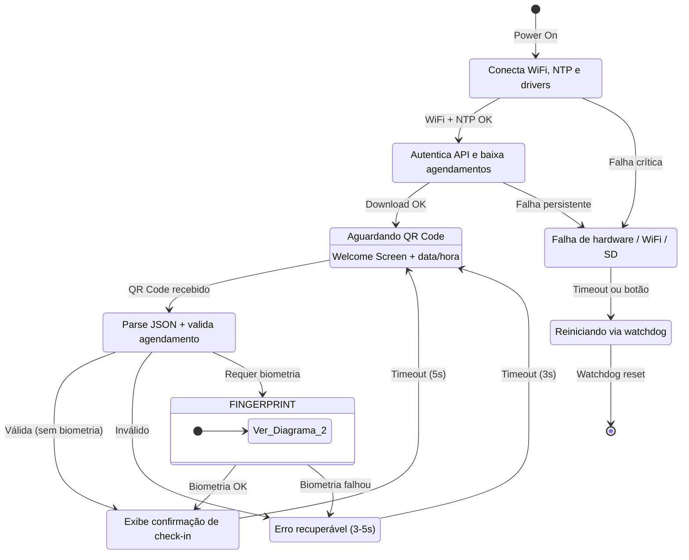
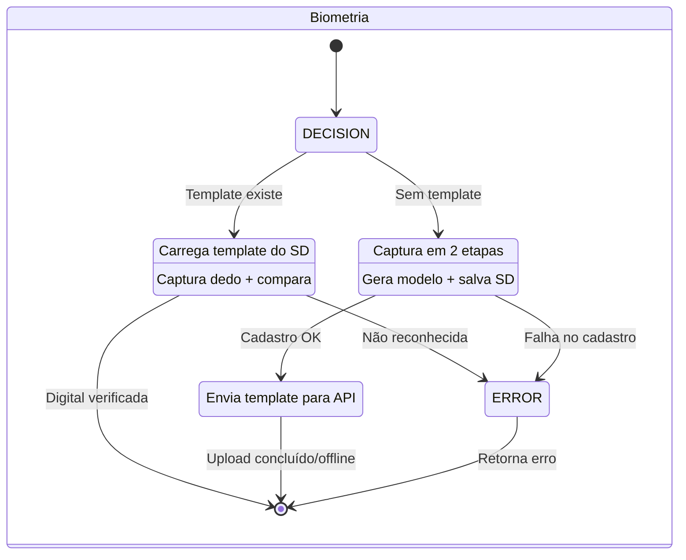

# State Machine Diagram

## 1. Fluxo Principal

Inicialização, check-in e tratamento de erros.

---

## 2. Sub-estados Biométricos

Detalhamento do fluxo de fingerprint dentro do check-in.

## Descrição dos Estados

| Estado | Descrição | Próximos Estados |
|--------|-----------|------------------|
| `INITIALIZING` | Boot do sistema, conexão WiFi e sincronização NTP | `DOWNLOADING_APPOINTMENTS`, `ERROR_CRITICAL` |
| `DOWNLOADING_APPOINTMENTS` | Autenticação na API e download dos agendamentos do dia | `IDLE`, `ERROR_CRITICAL` |
| `IDLE` | Aguardando leitura de QR Code na Welcome Screen | `VALIDATING` |
| `VALIDATING` | Processando e validando dados do QR Code | `FINGERPRINT_VERIFYING`, `FINGERPRINT_ENROLLING`, `APPOINTMENT`, `ERROR` |
| `FINGERPRINT_VERIFYING` | Verificando digital do paciente contra template armazenado | `APPOINTMENT`, `ERROR` |
| `FINGERPRINT_ENROLLING` | Cadastrando digital do paciente (captura em 2 etapas) | `FINGERPRINT_UPLOADING`, `ERROR` |
| `FINGERPRINT_UPLOADING` | Enviando template biométrico para API | `APPOINTMENT` |
| `APPOINTMENT` | Exibindo confirmação de check-in ao paciente | `IDLE` |
| `ERROR` | Erro recuperável (QR inválido, consulta não encontrada, digital falhou) | `IDLE` |
| `ERROR_CRITICAL` | Erro crítico que requer intervenção | `RESTARTING` |
| `RESTARTING` | Sistema reiniciando via watchdog | `INITIALIZING` |
