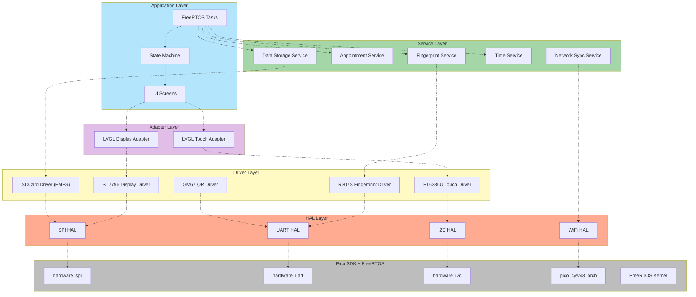

# Medical Clinic Check-in System

Sistema embarcado de check-in para clínicas médicas baseado em Raspberry Pi Pico W. O paciente agenda sua consulta via Telegram Bot, apresenta o QR Code no totem, o dispositivo valida o agendamento, realiza verificação/cadastro biométrico e confirma o check-in com sincronização periódica via API REST.

---

## Sumário

- [Visão Geral](#visão-geral)
- [Hardware](#hardware)
- [Arquitetura de Software](#arquitetura-de-software)
- [Máquina de Estados](#máquina-de-estados)
- [Fluxo de Check-in](#fluxo-de-check-in)
- [Configuração](#configuração)
- [Build e Flash](#build-e-flash)
- [Backend (API + Bot)](#backend-api--bot)
- [Dependências](#dependências)
- [Estrutura do Projeto](#estrutura-do-projeto)
- [Demos Standalone](#demos-standalone)

---

## Visão Geral

| Item | Detalhe |
|------|---------|
| **MCU** | RP2040W — Dual-core ARM Cortex-M0+ @ 133 MHz, WiFi CYW43439 |
| **RTOS** | FreeRTOS (5 tasks, queues, event groups) |
| **UI** | LVGL v8.3.11 — 7 telas, ícones desenhados via código |
| **Linguagem** | C++17 / C11 |
| **Build** | CMake ≥ 3.13 + Ninja 1.12.1 + GCC ARM 14_2_Rel1 |

**Funcionalidades principais:**
- Leitura de QR Code via scanner GM67 (UART)
- Validação de agendamento com dados armazenados no SD Card (FatFS)
- Verificação e cadastro de impressão digital via sensor R307S
- Sincronização de agendamentos e templates biométricos com API REST (Mongoose HTTP)
- Sincronização de hora via NTP (SNTP/lwIP)
- Interface touchscreen 4.0" 480×320

---

## Hardware

| Periférico | Interface | Pinos |
|-----------|-----------|-------|
| Display ST7796 4.0" TFT 480×320 | SPI0 | MOSI=GP19, SCK=GP18, CS=GP17, DC=GP20, RST=GP21 |
| Touch FT6336U (Capacitivo) | I2C1 | SDA=GP6, SCL=GP7, RST=GP8, INT=GP9 |
| Scanner QR GM67 | UART0 | TX=GP0, RX=GP1 |
| Sensor Biométrico R307S | UART1 | TX=GP4, RX=GP5 |
| SD Card (FAT32) | SPI1 | MISO=GP12, MOSI=GP15, SCK=GP14, CS=GP13 |
| WiFi CYW43439 | Integrado | — |

> Diagrama completo em [`docs/diagrams/hardware_diagram.md`](docs/diagrams/hardware_diagram.md)

---

## Arquitetura de Software

O sistema segue uma arquitetura em **6 camadas**, desacoplando hardware de lógica de negócio:



### Tasks FreeRTOS

| Task | Prioridade | Stack | Responsabilidade |
|------|:----------:|:-----:|------------------|
| `WiFi_Time_Init` | 5 | 2048 | Conecta WiFi, sincroniza NTP, auto-deleta após sucesso |
| `LVGL` | 4 | 3072 | `lv_timer_handler()` a cada 20 ms, gerencia telas por estado |
| `QR_Reader` | 3 | 1536 | Leitura contínua do GM67, envia dados para fila |
| `QR_Validator` | 2 | 2048 | Valida QR, biometria, marca check-in (orquestrador) |
| `Network` | 2 | 3072 | Download de agendamentos/templates, atualiza status na API |

### Services (Singletons)

| Service | Função |
|---------|--------|
| `AppointmentService` | Valida QR JSON, busca agendamento no SD, verifica CPF e janela de horário (−20/+10 min) |
| `NetworkSyncService` | Cliente HTTP (Mongoose): autenticação JWT, download/upload de agendamentos e templates |
| `DataStorageService` | Lê/grava JSON de agendamentos e templates `.dat` de fingerprint no SD Card (FatFS) |
| `TimeService` | Sincroniza NTP → RTC do RP2040, fornece data/hora formatadas |
| `FingerprintService` | Cadastro (2 capturas → template → SD + API) e verificação de digitais via R307S |

> Todos os diagramas em [`docs/diagrams/`](docs/diagrams/): [classes](docs/diagrams/class_diagrams.md) · [sequência](docs/diagrams/sequence_diagrams.md) · [arquitetura](docs/diagrams/software_architecture_layers_diagram.md)

---

## Máquina de Estados

| Estado | Descrição | Próximos Estados |
|--------|-----------|------------------|
| `INITIALIZING` | Boot, conexão WiFi e sincronização NTP | `DOWNLOADING_APPOINTMENTS`, `ERROR_CRITICAL` |
| `DOWNLOADING_APPOINTMENTS` | Autenticação na API e download dos agendamentos do dia | `IDLE`, `ERROR_CRITICAL` |
| `IDLE` | Welcome Screen aguardando leitura de QR Code | `VALIDATING` |
| `VALIDATING` | Parse e validação do QR Code (cJSON, CPF, horário) | `FINGERPRINT_*`, `APPOINTMENT`, `ERROR` |
| `FINGERPRINT_VERIFYING` | Verificação biométrica (template do SD → sensor) | `APPOINTMENT`, `ERROR` |
| `FINGERPRINT_ENROLLING` | Cadastro biométrico (2 capturas → template) | `FINGERPRINT_UPLOADING`, `ERROR` |
| `FINGERPRINT_UPLOADING` | Upload do template para API | `APPOINTMENT`, `ERROR` |
| `APPOINTMENT` | Tela de check-in confirmado | `IDLE` (timeout 5s) |
| `ERROR` | Erro recuperável (QR inválido, consulta não encontrada) | `IDLE` (timeout 3s) |
| `ERROR_CRITICAL` | Falha de hardware, SD ausente, WiFi indisponível | `RESTARTING` |
| `RESTARTING` | Reinício via watchdog | `INITIALIZING` |

> Diagrama Mermaid completo em [`docs/diagrams/state_machine_diagram.md`](docs/diagrams/state_machine_diagram.md)

---

## Fluxo de Check-in

1. **Boot** → Conecta WiFi, sincroniza NTP, inicializa drivers
2. **Download** → Autentica na API (JWT), baixa agendamentos do dia + templates biométricos para o SD Card
3. **Idle** → Welcome Screen com relógio aguardando QR Code
4. **QR Scan** → GM67 lê QR → `task_qr_reader` envia JSON para fila FreeRTOS
5. **Validação** → `task_qr_validator` faz parse (cJSON), busca agendamento no SD, valida CPF e janela de horário
6. **Biometria** (se necessário):
   - *Verificação*: carrega template do SD → sensor → captura e compara
   - *Cadastro*: 2 capturas → gera template → salva no SD + upload para API
7. **Confirmação** → Tela de check-in confirmado, marca agendamento como "realizada" (local + API)
8. **Retorno** → Timeout → volta para Idle

---

## Configuração

Todas as configurações ficam centralizadas em `config/`:

| Arquivo | Descrição |
|---------|----------|
| `wifi_config.hpp` | SSID, senha e país do WiFi |
| `api_config.hpp` | URL da API, endpoints, credenciais, timeouts |
| `pin_config.hpp` | Mapeamento de todos os GPIOs |
| `display_config.hpp` | Resolução, rotação, SPI speed, buffer LVGL |
| `fingerprint_config.hpp` | UART e baudrate do sensor biométrico |
| `qr_code_reader_config.hpp` | UART e baudrate do scanner QR |
| `FreeRTOSConfig.h` | Configuração do kernel FreeRTOS |
| `lv_conf.h` | Configuração do LVGL |
| `hw_config.c` | Configuração do SD Card (FatFS) |
| `mongoose_config.h` | Configuração do Mongoose HTTP |
| `lwipopts.h` | Configuração do lwIP (TCP/IP stack) |

Antes de compilar, edite pelo menos:

**WiFi** (`config/wifi_config.hpp`):
```cpp
#define WIFI_SSID     "SuaRede"
#define WIFI_PASSWORD "SuaSenha"
#define WIFI_COUNTRY  "BR"
```

**API** (`config/api_config.hpp`):
```cpp
#define API_BASE_URL  "http://192.168.0.13:8000"
#define API_USERNAME  "seu_usuario"
#define API_PASSWORD  "sua_senha"
```

**Pinos** (`config/pin_config.hpp`): altere caso sua fiação seja diferente.

---

## Build e Flash

### Pré-requisitos

- [VS Code](https://code.visualstudio.com/) com extensão [**Raspberry Pi Pico**](https://marketplace.visualstudio.com/items?itemName=raspberry-pi.raspberry-pi-pico)
- Pico SDK 2.1.1, GCC ARM 14_2_Rel1, CMake ≥ 3.13, Ninja 1.12.1
- (Ou use o **Dev Container** incluso — tudo já configurado)

### Compilar

**Via extensão Raspberry Pi Pico (recomendado):**
1. Abra o projeto no VS Code
2. `Ctrl+Shift+B` → selecione **Compile Project**

**Via terminal:**
```bash
mkdir -p build && cd build
cmake .. -G Ninja
ninja
```

### Flash no Pico

**Via extensão Raspberry Pi Pico (recomendado):**
1. Conecte o Pico via USB
2. Clique no botão **Run** na barra de status, ou execute a task **Run Project**

**Via terminal:**
```bash
# picotool (sem desconectar USB):
picotool load build/medical-clinic-checkin-pico.elf -fx

# Ou UF2 manual: segure BOOTSEL, conecte USB, copie o .uf2
cp build/medical-clinic-checkin-pico.uf2 /media/$USER/RPI-RP2/
```

### Monitor Serial

```bash
minicom -b 115200 -o -D /dev/ttyACM0
```

---

## Backend (API + Bot)

O sistema embarcado se comunica com um backend composto por:

- **API REST** (FastAPI + PostgreSQL) — gerencia pacientes, profissionais, agendamentos e biometria
- **Telegram Bot** — agendamento de consultas pelo paciente, com envio do QR Code

> Repositório do backend: [Luana-Menezes/Clinicas_Medicas_WebAPI](https://github.com/Luana-Menezes/Clinicas_Medicas_WebAPI)

---

## Dependências

| Biblioteca | Versão | Origem | Uso |
|-----------|--------|--------|-----|
| [Pico SDK](https://github.com/raspberrypi/pico-sdk) | 2.1.1 | SDK | `pico_stdlib`, `hardware_spi`, `hardware_i2c`, `hardware_uart`, `hardware_rtc`, `pico_cyw43_arch`, lwIP |
| [FreeRTOS-Kernel](https://github.com/FreeRTOS/FreeRTOS-Kernel) | — | Submodule | RTOS: tasks, queues, event groups, semáforos |
| [LVGL](https://github.com/lvgl/lvgl) | 8.3.11 | FetchContent | Interface gráfica touchscreen |
| [no-OS-FatFS](https://github.com/carlk3/no-OS-FatFS-SD-SPI-RPi-Pico) | — | Submodule | Sistema de arquivos FAT32 no SD Card via SPI |
| [cJSON](https://github.com/DaveGamble/cJSON) | 1.7.18 | FetchContent | Parser JSON (agendamentos, QR Code) |
| [Mongoose](https://github.com/cesanta/mongoose) | 7.20 | FetchContent | Cliente HTTP para comunicação com a API |

---

## Estrutura do Projeto

```
├── CMakeLists.txt
├── pico_sdk_import.cmake
│
├── config/
│   ├── api_config.hpp                  # URL da API, endpoints, credenciais, timeouts
│   ├── display_config.hpp              # Resolução, rotação, SPI speed, buffer LVGL
│   ├── fingerprint_config.hpp          # UART e baudrate do sensor biométrico
│   ├── FreeRTOSConfig.h                # Configuração do kernel FreeRTOS
│   ├── hw_config.c                     # Configuração do SD Card (FatFS)
│   ├── lv_conf.h                       # Configuração do LVGL
│   ├── lvgl_tick_custom.h              # Tick customizado do LVGL para FreeRTOS
│   ├── lwipopts.h                      # Configuração do lwIP (TCP/IP stack)
│   ├── mongoose_config.h               # Configuração do Mongoose HTTP
│   ├── pin_config.hpp                  # Mapeamento de todos os GPIOs
│   ├── qr_code_reader_config.hpp       # UART e baudrate do scanner QR
│   ├── sntp_callbacks.h                # Callbacks de sincronização NTP
│   └── wifi_config.hpp                 # SSID, senha e país do WiFi
│
├── src/
│   ├── main.cpp                        # Entry point: init drivers → create tasks → scheduler
│   │
│   ├── core/
│   │   ├── state_machine.hpp           # Máquina de estados (singleton, 11 estados)
│   │   └── state_machine.cpp
│   │
│   ├── hal/
│   │   ├── interfaces/
│   │   │   ├── hal_spi_interface.hpp   # Interface abstrata SPI
│   │   │   ├── hal_i2c_interface.hpp   # Interface abstrata I2C
│   │   │   ├── hal_uart_interface.hpp  # Interface abstrata UART
│   │   │   └── hal_wifi_interface.hpp  # Interface abstrata WiFi
│   │   └── rp2040/
│   │       ├── hal_spi_rp2040.hpp/.cpp
│   │       ├── hal_i2c_rp2040.hpp/.cpp
│   │       ├── hal_uart_rp2040.hpp/.cpp
│   │       └── hal_wifi_rp2040.hpp/.cpp
│   │
│   ├── drivers/
│   │   ├── display/
│   │   │   ├── interface/display_interface.hpp
│   │   │   └── st7796/st7796_driver.hpp/.cpp
│   │   ├── touch/
│   │   │   ├── interface/touch_interface.hpp
│   │   │   └── ft6336u/ft6336u_driver.hpp/.cpp
│   │   ├── qr_code_reader/
│   │   │   ├── interface/qr_interface.hpp
│   │   │   └── gm67/gm67_driver.hpp/.cpp
│   │   └── fingerprint/
│   │       ├── interface/fingerprint_interface.hpp
│   │       └── r307s/r307s_driver.hpp/.cpp
│   │
│   ├── adapters/lvgl/
│   │   ├── lvgl_display_adapter.hpp/.cpp
│   │   └── lvgl_touch_adapter.hpp/.cpp
│   │
│   ├── services/
│   │   ├── appointment_service.hpp/.cpp     # Validação de QR e agendamentos
│   │   ├── data_storage_service.hpp/.cpp    # Leitura/escrita no SD Card
│   │   ├── fingerprint_service.hpp/.cpp     # Cadastro e verificação biométrica
│   │   ├── network_sync_service.hpp/.cpp    # Cliente HTTP (Mongoose)
│   │   └── time_service.hpp/.cpp            # NTP → RTC, data/hora
│   │
│   ├── tasks/
│   │   ├── task_wifi_time_init.hpp/.cpp     # Conexão WiFi + sincronização NTP
│   │   ├── task_lvgl.hpp/.cpp               # Loop LVGL + gerência de telas
│   │   ├── task_qr_reader.hpp/.cpp          # Leitura contínua do scanner QR
│   │   ├── task_qr_validator.hpp/.cpp       # Validação e orquestração do check-in
│   │   └── task_network.hpp/.cpp            # Download de agendamentos e templates
│   │
│   ├── ui/screens/
│   │   ├── welcome_screen.hpp/.cpp          # Tela principal (idle)
│   │   ├── init_status_screen.hpp/.cpp      # Tela de boot (WiFi, NTP, SD)
│   │   ├── appointment_screen.hpp/.cpp      # Check-in confirmado
│   │   ├── error_screen.hpp/.cpp            # Erro recuperável
│   │   ├── error_critical_screen.hpp/.cpp   # Erro crítico + countdown reboot
│   │   ├── fingerprint_operation_screen.hpp/.cpp  # Verificação/cadastro digital
│   │   └── fingerprint_upload_screen.hpp/.cpp     # Upload de template
│   │
│   └── tests/code_examples/
│       ├── README.md                        # Instruções dos demos
│       ├── lvgl_rtos_demo.cpp               # Demo display + touch
│       ├── qr_code_reader_demo.cpp          # Demo scanner QR
│       ├── fingerprint_demo.cpp             # Demo sensor biométrico
│       ├── sdcard_fatfs_demo.cpp            # Demo SD Card
│       └── wifi_demo.cpp                    # Demo WiFi
│
├── lib/
│   ├── FreeRTOS-Kernel/                     # Submodule
│   └── no-OS-FatFS/                         # Submodule
│
└── docs/
    ├── dev/                                 # Notas de desenvolvimento por periférico
    └── diagrams/
        ├── hardware_diagram.md
        ├── software_architecture_layers_diagram.md
        ├── class_diagrams.md
        ├── sequence_diagrams.md
        └── state_machine_diagram.md
```

---

## Demos Standalone

O projeto inclui demos para testar cada periférico isoladamente. Para compilar um demo específico, altere `BUILD_TARGET` no CMake:

```bash
cd build
cmake .. -G Ninja -DBUILD_TARGET=QR_DEMO
ninja
```

| Target | Testa |
|--------|-------|
| `MAIN` | Aplicação completa (padrão) |
| `LVGL_DEMO` | Display + touchscreen com widgets LVGL |
| `QR_DEMO` | Scanner GM67 em modo contínuo |
| `FINGERPRINT_DEMO` | Sensor R307S — cadastro, verificação, busca, exclusão |
| `SDCARD_DEMO` | SD Card — mount, leitura, escrita, listagem |
| `WIFI_DEMO` | WiFi — conexão, scan, DNS, TCP echo server, RSSI |

> Instruções detalhadas em [`src/tests/code_examples/README.md`](src/tests/code_examples/README.md)

---